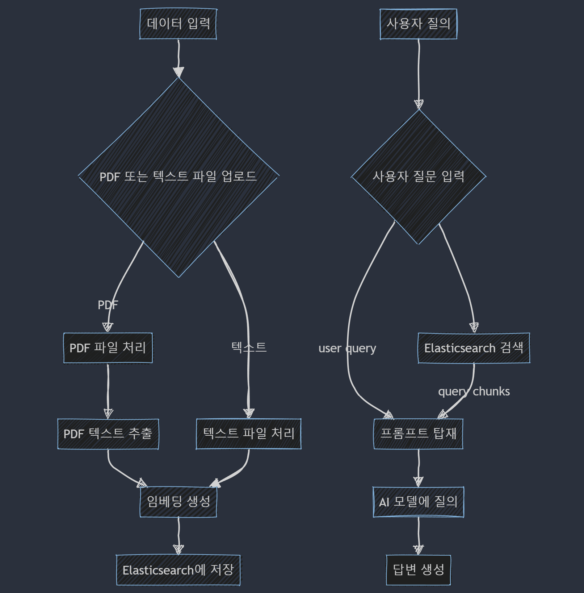

# 게임 초보자를 위한 챗봇 프로젝트
### 프로젝트 개요
프로젝트 이름: 게임 초보자 지원 챗봇 개발

목표: 게임 초보자에게 실시간으로 도움을 제공하는 AI 기반 챗봇을 개발하여, 
게임 플레이 중 발생하는 다양한 질문과 문제를 해결함으로써 사용자 경험을 향상시키는 것을 목표로 합니다.

### 배경 및 필요성
   게임 초보자들은 게임 플레이 중 다양한 질문이나 문제에 직면할 수 있습니다. 
   기존의 도움말이나 FAQ는 정적인 정보 제공에 그치며, 실시간으로 변동하는 상황에 대한 대처가 어렵습니다. 
   따라서, 사용자와 실시간으로 상호작용하며, 맞춤형 답변을 제공할 수 있는 AI 챗봇의 필요성을 느꼈습니다.

### 사용된 기술
   Spring Boot, Spring AI, Elasticsearch, Kibana, Docker 

### Flowchart

### 기술적 고민
- 자연어 처리(NLP)에서 언어 모델의 성능을 향상시키기 위해 사용되는 기술 고민

  https://vamlin.tistory.com/19
- PDF 문서를 통해 대량의 데이터 임베딩 저장

  https://vamlin.tistory.com/21
- 프로젝트에 적합한 Vector Database 선정

  https://vamlin.tistory.com/22